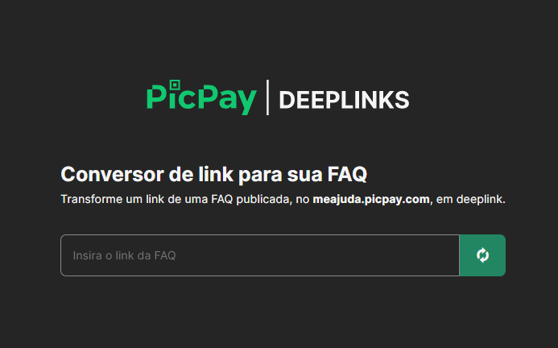

 

    
    <h1></h1>
    Ferramenta para converter links de FAQs em deeplinks.

 

## Sobre

O objetivo desta ferramenta e converter uma url padrão de FAQ `meajuda.picpay.com` para um deeplink que seja acessado via app `picpay://picpay/helpcenter/`.

## Como utilizar

1. Insira a URL padrão de clique para converter
2. Cole em qualquer lugar, o deeplink já estará na área de transferências (clipboard)
3. Caso queira testar, colo no slack e abra pelo celular

## Autor

|      [Rafael Prado](http://www.github.com/rpradosilva)      |
| :---------------------------------------------------------: |
|  |

---

